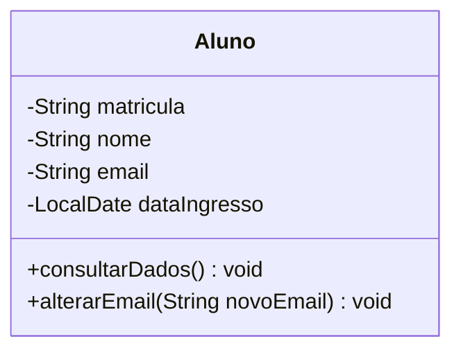
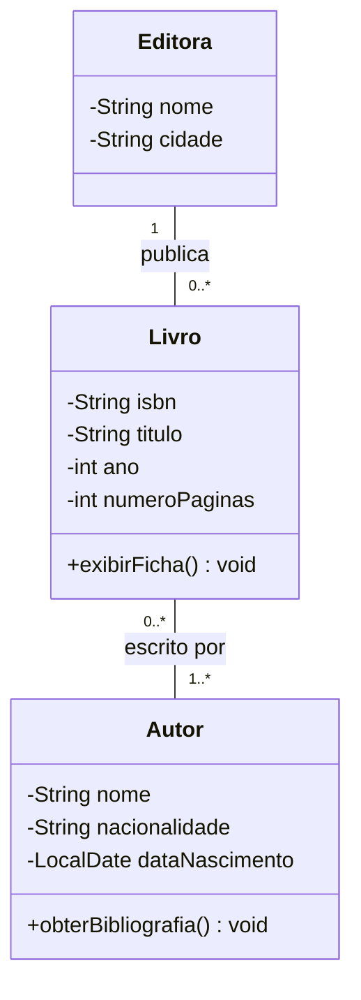
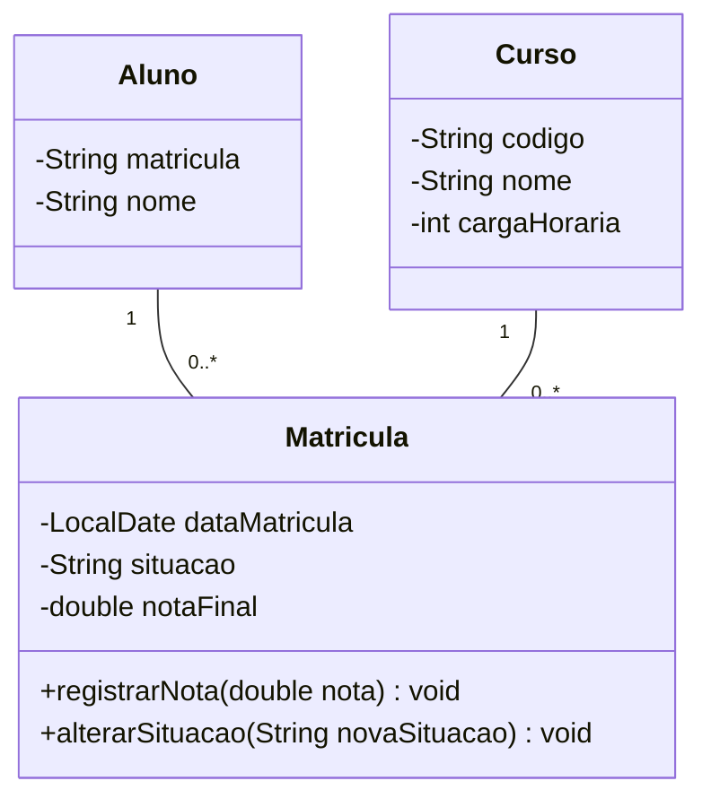
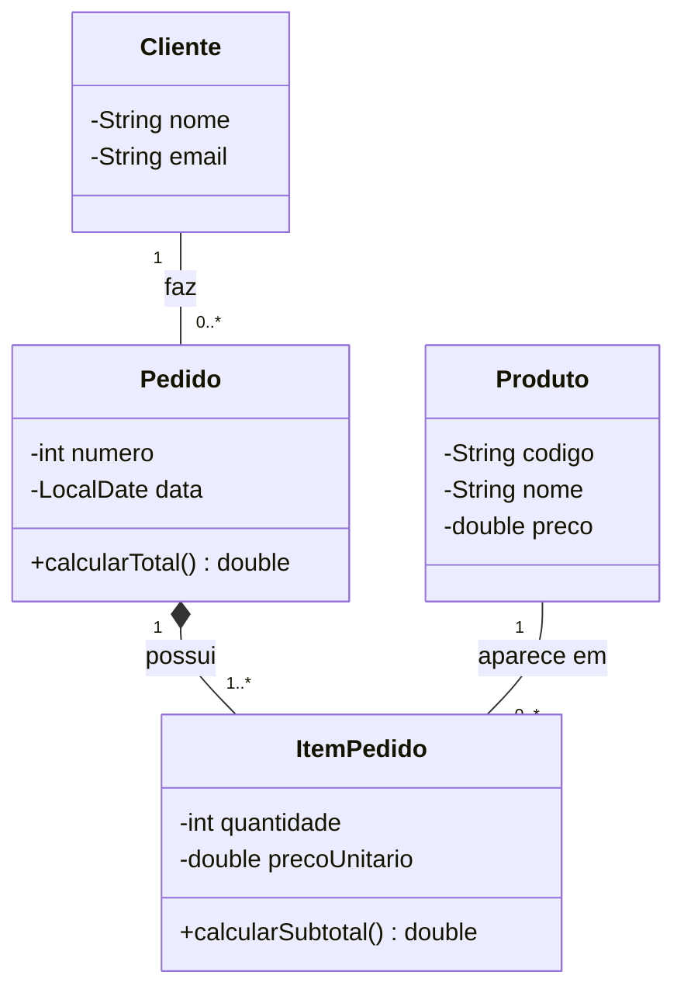
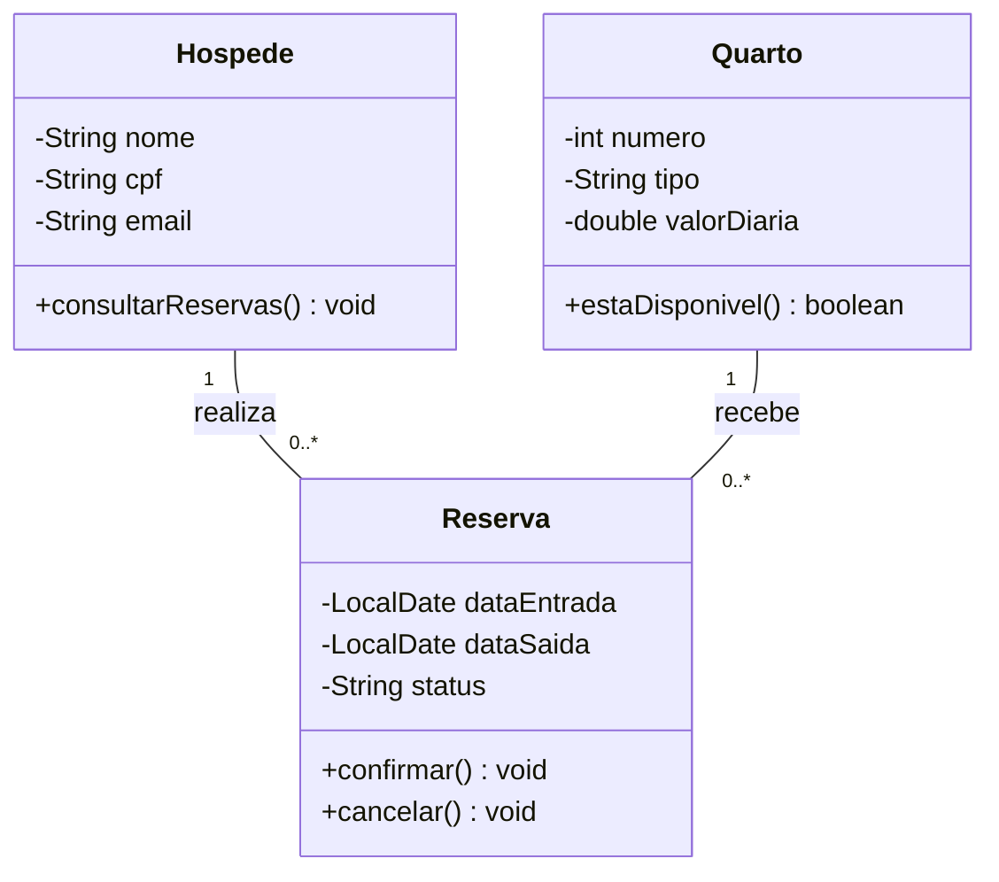
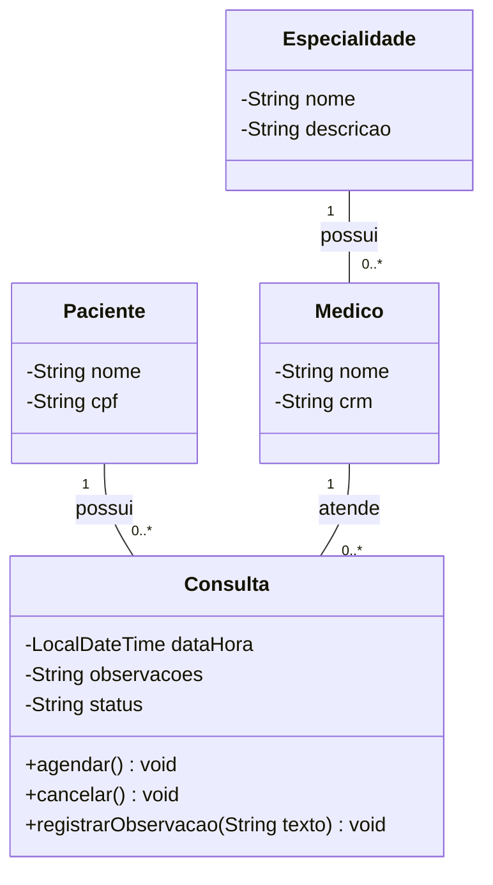
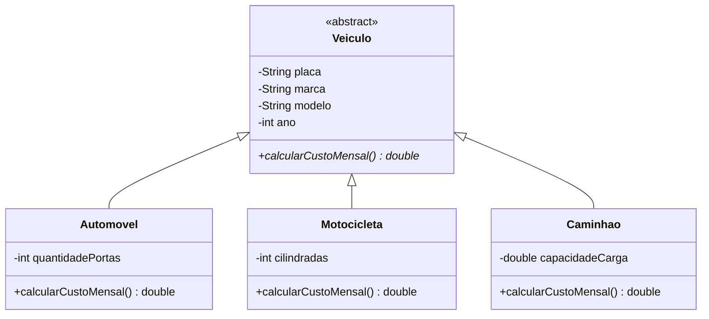
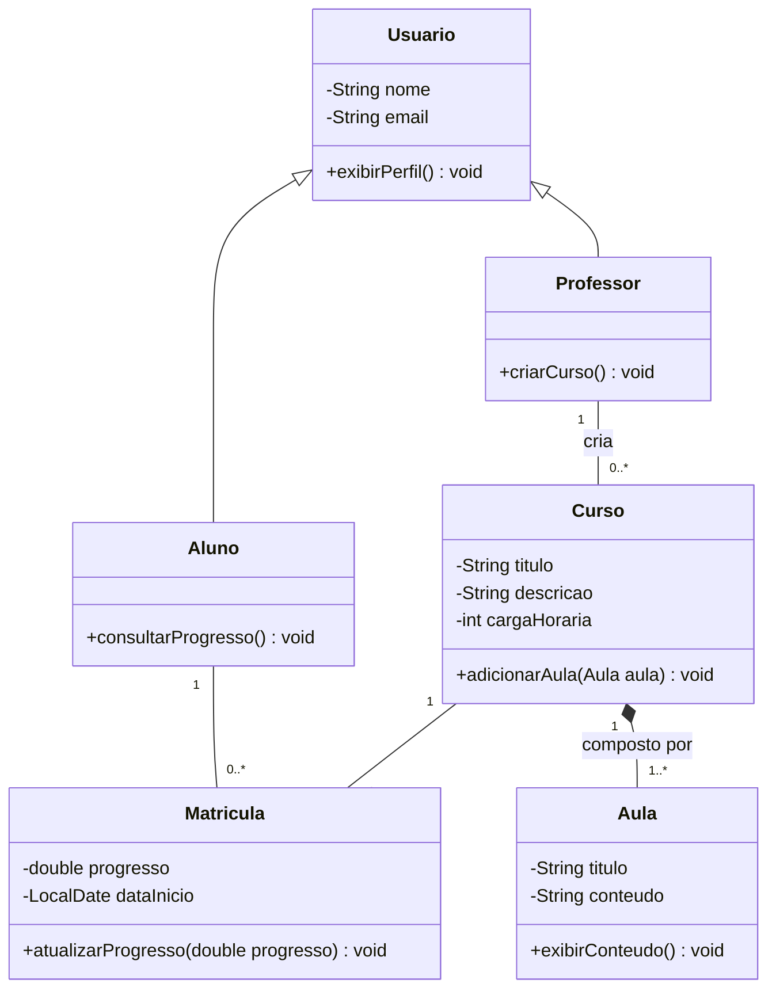
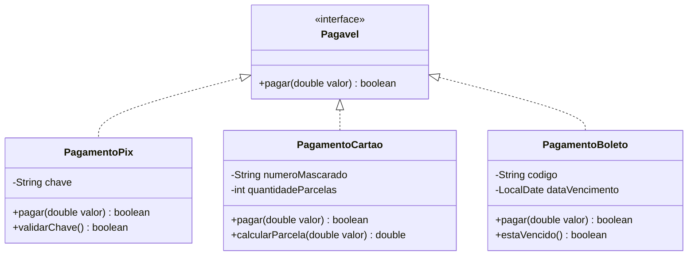
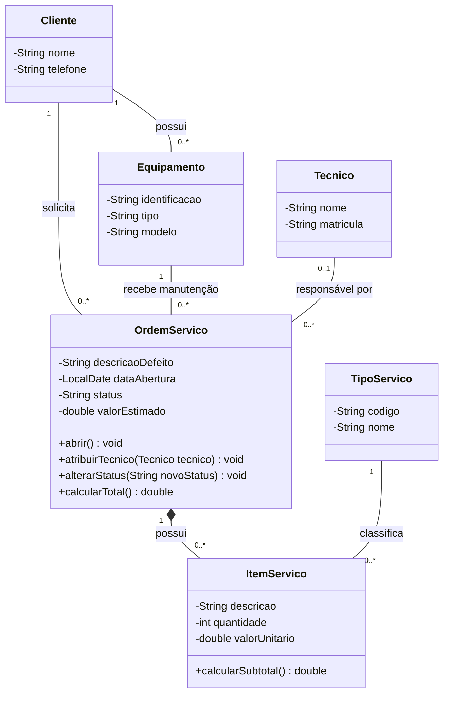

# POO - Atividade 3

Resolução dos exercícios de **Diagramas de Classes UML**.

## Exercício 1 — Cadastro de estudantes

## Exercício 2 — Livros, autores e editoras

## Exercício 3 — Curso, aluno e matrícula

## Exercício 4 — Loja virtual e itens de pedido

**Anotação:** `ItemPedido` foi modelado como classe porque o vínculo entre `Pedido` e `Produto` possui dados próprios, como `quantidade` e `precoUnitario`. Além disso, o item faz parte do ciclo de vida do pedido, justificando a composição.

## Exercício 5 — Hotel, quartos e reservas

## Exercício 6 — Clínica e consultas médicas

## Exercício 7 — Frota com especialização de veículos

## Exercício 8 — Plataforma de cursos on-line

## Exercício 9 — Formas de pagamento

## Exercício 10 — Assistência técnica — modelo integrado

**Revisão do modelo:** `Cliente`, `Equipamento`, `Tecnico` e `TipoServico` não foram representados como simples atributos dentro de `OrdemServico` ou `ItemServico`. Como são conceitos próprios do domínio, com identidade e dados próprios, aparecem como classes relacionadas por associações. A multiplicidade `0..1` no lado de `Tecnico` representa que uma ordem pode ainda não possuir técnico responsável.
